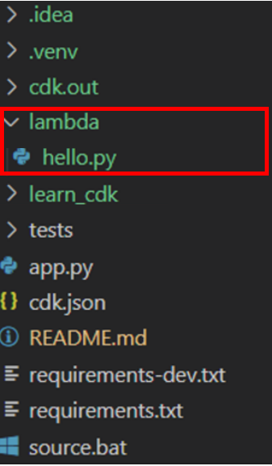
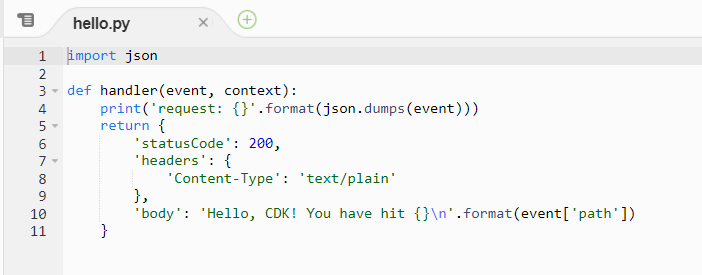
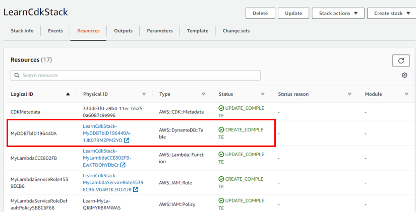

# Welcome Developers!
Hi there, and thanks for joining us. We can't wait for you to start re-imagining infrastructure-as-code(IaC) with AWS CDK.

The AWS CDK lets you build reliable, scalable, cost-effective applications in the cloud with th econsiderable expressive power of a programming language. 

So what are we going to build? Nothing too fancy...

We will spend some time setting up your development environment and learning a little about how to work with the CDK Toolkit to deploy your app to an AWS environment.

Then, you will write a little "Good Evening lades" Lambda function and front it with an API Gateway endpoint so users can call it via an HTTP request.

Next, we will modify our Lambda function to include CRUD (create, retrieve, update, delete) operations for the top 5 inspiring women in tech!

Finally, we will show you how to teardown the infrastructures you have created with a single command. 

By the end of this workshop, you will be able to:
* Create new CDK applications
* Define your app's infrastructure using the AWS Construct Library
* Deploy your CDK apps to your AWS account

## See Also:
AWS CDK User Guide:
https://docs.aws.amazon.com/cdk/v2/guide/home.html
AWS CDK Reference:
https://docs.aws.amazon.com/cdk/api/v2/python/index.html


## Prerequisites for the workshop

 * AWS CLI
 * An AWS Account
 * An IDE to create the app in, such as Microsoft Visual Studio or JetBrains
 * An API Client, such as Insomnia or Postman
 * Docker
 * NodeJS >= v12
 * NPM >= v6
 * Python >= 3.7
 * CDK - installation guide can be found here: 
 https://docs.aws.amazon.com/cdk/v2/guide/getting_started.html
 * SAM - installation guide can be found here: 
 https://docs.aws.amazon.com/serverless-application-model/latest/developerguide/serverless-sam-cli-install.html 
  
## Useful commands

 * `cdk ls`          list all stacks in the app
 * `cdk synth`       emits the synthesized CloudFormation template
 * `cdk deploy`      deploy this stack to your default AWS account/region
 * `cdk diff`        compare deployed stack with current state
 * `cdk docs`        open CDK documentation
 
# 1. Setting up Project

## 1.1. Create a project directory
Create an empty directory on your system:

```bash
mkdir learnCDK
```

## 1.2. cdk init
We will use `cdk init` to create a new Python CDK project

```bash
$ cd learnCDK
$ cdk init --language python
```

## 1.3. Activating the Virtualenv
After the init process completes, create and activate the virtualenv.

```bash
$ python3 -m venv .venv
$ source .venv/bin/activate
```

Once the virtualenv is activated, you can install the required dependencies.

```bash
$ pip install -r requirements.txt
```

## 1.4. Project Structure
Now's a good time to open the project in your favourite IDE and explore.
If you use VSCode, you can just type `code .` within the project directory.

### 1.4.1. Explore your project directory


We can then synthesize:
```bash
$ cdk synth
```
This will output the following CloudFormation template:


## 1.5. Bootstrapping an environment
Install the bootstrap stack into an environment:

```bash
$ cdk bootstrap
```

Let's take a look at the AWS CloudFormation Console. You will likely see something like this (if you don't, make sure you are in the correct region):


# 2. Let's Deploy!

We wil finally write some CDK code. In this workshop, we will add a Lambda function with an API Gateway endpoint infront of it. The Lambda function interacts with DynamoDB, and returns a response to API Gateway then API Gateway returns a response to you. 


 
## 2.1. Deploy Lambda
In this section we will focus on building the API Gateway and Lambda function. 
Users will be able to hit any URl in the endpoint and the'll receive a heart warming greeting from our function.


Create a directory **lambda** in the root of your project tree. Add a file called **lambda/hello.py** with the following contents:


```python
import json

def handler(event, context):
    print('request: {}'.format(json.dumps(event)))
    return {
        'statusCode': 200,
        'headers': {
            'Content-Type': 'text/plain'
        },
        'body': 'Hello, CDK! You have hit {}\n'.format(event['path'])
    }
```
This is a simple Lambda function which returns the text "Hello CDK! You've hit [url path]". The function's output also includes the HTTP status code and HTTP headers. These are used by API Gateway to formulate the HTTP response to the user.

### 2.1.1. AWS Construct Library 
The AWS CDK is shipped with an extensive library of constructs called the **AWS Construct Library**. 

The construct library is divided into modules, one for each AWS service.


For example, if you want to define an AWS Lambda function, we will need to use the AWS Lambda construct library.

To discover and learn about AWS construct, you can browse the AWS Construct Library reference _(supports Python, Java, .NET)_ by entering the following command:

```bash
$ cdk docs
```


### 2.1.2. Add Lambda Construct  
In **learn_cdk/learn_cdk_stack.py**, add an AWS Lambda function to your stack.

```python
from aws_cdk import (
    Stack,
    aws_lambda as _lambda,
)
from constructs import Construct


class LearnCdkStack(Stack):
    def __init__(self, scope: Construct, construct_id: str, **kwargs) -> None:
        super().__init__(scope, construct_id, **kwargs)

        my_lambda = _lambda.Function(
            self,
            "MyLambda",
            code=_lambda.Code.from_asset("lambda"),
            handler="hello.handler",
            runtime=_lambda.Runtime.PYTHON_3_7,
        )
```

### 2.1.3. Testing the Lambda function locally
Let us test our Lambda function locally. Local testing tightens the feedback loop by making it possible for you to find and troubleshoot issues that you might run into before deploying to the cloud.

Run sam **--version** to verify that you have successfully installed AWS SAM CLI.

```bash
$ sam --version
```

We need to prepare the Lambda payload JSON object that will be passed into the Lambda when invoking Lambda locally. Save the following JSON in a file in your project root directory and name it **testEvent.json**

```json
{
    "body": "Hello WiT!",
    "path": "/hello/wit"
}
```

Before we invoke it locally, let's do a 'recompile' of the CDK code by running

```bash
$ cdk synth
```

You would be able to see the CloudFormation template being printed out. This indicates that **cdk synth** command ran successfully and there is no error in your **learn_cdk/learn_cdk_stack.py**

Now, change directory into **cdk.out** folder

```bash
$ cd cdk.out
```

and run the following

```bash
$ sam local invoke --template LearnCdkStack.template.json --event ../testEvent.json
```

You would be able to see the result like shown in the image below.


Note: If you see the following error message, it means that you did not install Docker on your system.

```bash
Error: Running AWS SAM projects locally requires Docker. Have you got it installed?
```

Play around with local testing by modifying the values in **testEvent.json** and your Lambda code in **lambda/hello.py** and re-running the AWS SAM local invoke command.


### 2.1.4. Deploy Lambda Construct  
Lets deploy to the cloud now!

```bash
$ cdk deploy
```

The output will look something like this:


The exact time will vary but we should get a pretty good idea of how long a normal deployment takes!

### 2.1.5. Verify in CloudFormation
Navigate to **AWS CloudFormation** and verify if the stack is deployed successfully.


Click on the stack, and go to _Resources_. You should see the IAM Role and Lambda function is created. 

Open the **Lambda** function in a new window.


The code should be loaded onto the screen. 


Click on **Test** and configure the test event as below. 
**Event name:** test
**Template:** apigateway-aws-proxy


**Save** and **Test** the test event. You should see the expected output:


### 2.1.6. Update the Lambda function
Let's make some changes and update the handler function. In **lambda/hello.py**:
```python
import json

def handler(event, context):
    print('request: {}'.format(json.dumps(event)))
    return {
        'statusCode': 200,
        'headers': {
            'Content-Type': 'text/plain'
        },
        'body': 'Good evening ladies, welcome to CDK! You have hit {}\n'.format(event['path'])
    }
```
Lets deploy the latest changes. 
```bash
$ cdk deploy --hotswap
```

Note: with `cdk deploy --hotswap`, we can speed up the deployment time, instead of a CloudFormation deployment.

Let's go to the **AWS Lambda** console and double check if the code changes!


## 2.2. Deploy API Gateway
Next step is to add an API Gateway in front of our function. API Gateway will expose a public HTTP endpoint that anyone on the internet an hit with an HTTP client such as _curl_ or a web browser.

We will use Lambda proxy integration mounted to the root of the API. This means that any requests to any URL path will be proxied directly to our Lambda function, and the response from the function will be returned back to the user. 

### 2.2.1. Add LambdaRestAPI Construct
Let's add a LambdaRestApi construct to our stack. Here, we define an API endpoint and associated it with our Lambda function. In **learn_cdk/learn_cdk_stack.py**:

```python
from aws_cdk import (
    Stack, aws_lambda as _lambda, 
    aws_apigateway as apigw 
)
from constructs import Construct


class LearnCdkStack(Stack):
    def __init__(self, scope: Construct, construct_id: str, **kwargs) -> None:
        super().__init__(scope, construct_id, **kwargs)

        my_lambda = _lambda.Function(
            self,
            "MyLambda",
            code=_lambda.Code.from_asset("lambda"),
            handler="hello.handler",
            runtime=_lambda.Runtime.PYTHON_3_7,
        )

        apigw.LambdaRestApi(self, "myapi", handler=my_lambda)
```

### 2.2.2. Deploy LambdaRestAPI
Let's see what's going to happen when we deploy this:

```bash
$ cdk diff
```
Note: the command `cdk diff` compares the specified stack with the deployed stack or a local CloudFormation template

Output should look like this:


Lets deploy!

```bash
$ cdk deploy
```

When deployment completes, you'll notice this line:
```bash
Outputs:
LearnCdkStack.myapiEndpoint8EB17201 = https://xxxxxxxxxx.execute-api.eu-west-3.amazonaws.com/prod/
```
Note: This is a stack output that's automatically added by the API Gateway construct and includes the URL of the API Gateway endpoint.

Let's try to hit the endpoint with the web browser. Copy the URL and paste on your web browser


Good Job! You have successfully created a web application build on AWS Lambda and fronted by an AWS API Gateway! 

## 2.3. Deploy Amazon DynamoDB 
Now, let's enhance our application with CRUD (Create, Retrieve, Update, Delete) features. For this, we will be exploring with **Amazon DynamoDB**, a NoSQL database. 


### 2.3.1. Add DynamoDB API Construct
In **learn_cdk/learn_cdk_stack.py**, add the DynamoDB API Construct. 
We will be adding an IAM policy to allow read/write access to our DynamoDB table from our Lambda function.
We will be adding environment variable as well to the lambda function. 

```python
from aws_cdk import (
    Stack,
    aws_lambda as _lambda,
    aws_apigateway as apigw,
    aws_dynamodb as ddb,
)
from constructs import Construct


class LearnCdkStack(Stack):
    def __init__(self, scope: Construct, construct_id: str, **kwargs) -> None:
        super().__init__(scope, construct_id, **kwargs)

        my_ddb_table = ddb.Table(
            self,
            "MyDDBTbl",
            partition_key=ddb.Attribute(name="id", type=ddb.AttributeType.STRING),
        )

        my_lambda = _lambda.Function(
            self,
            "MyLambda",
            code=_lambda.Code.from_asset("lambda"),
            handler="hello.handler",
            runtime=_lambda.Runtime.PYTHON_3_7,
            environment={"DDB_TABLE_NAME": my_ddb_table.table_name},
        )
        my_ddb_table.grant_read_write_data(my_lambda)

        apigw.LambdaRestApi(self, "myapi", handler=my_lambda)

```

### 2.3.2. Create POST REST API 
Let's add the top 5 inspring women who changed the tech world! To do that, we will have to modify out lambda function.
In **lambda/hello.py**, update the existing code:

```python
import json
import os
from urllib import request
import boto3

# initialise ddb client and ddb_table
ddb = boto3.resource("dynamodb")
ddb_table = ddb.Table(os.environ["DDB_TABLE_NAME"])


def handler(event, context):
    return _200(event)


def _200(response_body):
    return {
        "statusCode": 200,
        "headers": {
            "Access-Control-Allow-Origin": "*",
            "Content-Type": "application/json",
        },
        "body": json.dumps(response_body),
    }

```
Note: Import new packages and intialise dynabodb client and dynamodb table. 
{{explain boto3 and other imported libraries}}

Let's deploy the latest changes:
```bash
$ cdk deploy
```
Note: Since we are deploying a DynamoDB table, we are updating our stack. Hence, we have to do `cdk deploy` instead of `cdk deploy --hotswap`.

Output should look like this:


Let's head over to **CloudFormation** console to see the output


### 2.3.3. Check out contents of Lambda function of _events_ 
Let's check out the contents of _event_. 
I will be using **Insomnia** to test my REST API.


Paste the following content in Insomnia:
```json
[
    {
        "id":"99",
        "name":"test"
    }
]
```
Note: Alternatively, you may test your REST API using other API Testing Tools such as Postman. 

Hit **Send Request**. You should see the following output:

Note: Image is non-exhausive. We are interested in **httpMethod**. In this workshop, we will be interested in four http methods - POST, GET, PUT and DELETE.


### 2.3.3. Add members to WiT!
Let's create a function to add the top 5 inspring women who changed the tech world!
In **lambda/hello.py**, add the following method to the **handler** function:
```python
def handler(event, context):
    HTTP_REQUEST = event["httpMethod"]

    if HTTP_REQUEST == "POST":
        request_body = json.loads(event["body"])
        for item in request_body:
            ddb_table.put_item(Item=item)
        return _200(request_body)
```
Let's deploy our latest chanegs.
```bash
$ cdk deploy --hotswap
```
You should see the following output:


Head over to **Insomnia** (or other API Test tool) and send a **POST** request to add the first inspiring women to our table!

Hit **Send Request** again. Output should be like this:


Let's head over to **DynamoDB** console to ensure that we have our first record in our table.


Great! Now let's add a few more inspiring ladies to our table
In **Insomnia**, add the following record to our table:
```http
[
    {
        "id":"1",
        "name":"Grace Hopper",
        "knownFor": "Creator of COBOL programming language"
    },
    {
        "id":"2",
        "name":"Ada Lovelace",
        "knownFor": "The World's First Computer Programmer"
    },
    {
        "id":"3",
        "name":"Hedy Lamarr",
        "knownFor": "The Inventor of Internet"
    },
    {
        "id":"4",
        "name":"Annie Easley",
        "knownFor": "The NASA Rocket Scientist"
    },
    {
        "id":"5",
        "name":"Mary Wilkes",
        "knownFor": "The First Home Computer User"
    }
]
```
Hit **Send** and you should see the following output


Let's head over to **DynamoDB** console to verify our table.


### 2.3.4. Retrieve members of WiT!
Sweet, now that we have added items in our table, let's create a **retrieve** method to get all the inspring women in our table.

In **lambda/hello.py**, add the following **GET** method:
```python
def handler(event, context):
    HTTP_REQUEST = event["httpMethod"]

    if HTTP_REQUEST == "POST":
        request_body = json.loads(event["body"])
        for item in request_body:
            ddb_table.put_item(Item=item)
        return _200(request_body)

    if HTTP_REQUEST == "GET":
        result = ddb_table.scan()
        return _200(result["Items"])

```
Let's deploy our latest changes:
```bash
$ cdk deploy --hotswap
```
Output should be the following:


Head over to **Insomnia** and create a new **GET** endpoint. 
Hit **Send** and you should see the following:


### 2.3.5. Update existing member's information
Oh no! We have added the wrong information for **Hedy Lamarr**. She is the **inventor of WiFi** instead or Internet. Let's **update** her record.

In **lambda/hello.py**, add the following **PUT** method:
```python
def handler(event, context):
    HTTP_REQUEST = event["httpMethod"]

    if HTTP_REQUEST == "POST":
        request_body = json.loads(event["body"])
        for item in request_body:
            ddb_table.put_item(Item=item)
        return _200(request_body)

    if HTTP_REQUEST == "GET":
        result = ddb_table.scan()
        return _200(result["Items"])
    
    if HTTP_REQUEST == "PUT":
        request_body = json.loads(event["body"])
        response = ddb_table.get_item(Key={"id": request_body["id"]})
        item_to_update = response["Item"]
        item_to_update["name"] = request_body["name"]
        ddb_table.put_item(Item=item_to_update)
        return _200(item_to_update)
```
Let's deploy our changes
```bash
$ cdk deploy --hotswap
```
Output should be the following:


Let's head over to **Insomnia** and create a new **PUT** request. 

In **Insomnia**, we will be updating the **KnownFor** column for **Hedy Lemarr**.
```json
{
    "id":"3",
    "name":"Hedy Lamarr",
    "knownFor": "The Inventor of WiFi"
}
```
Hit **Send**. You should see the following output:


Let's head to **DynamoDB** to verify if the table is updated.


Perfect! And the very last step, let's clean up our table by removing the **test entry**.

### 2.3.5. Delete test entries in WiT!
In **lambda/hello.py**, add the following code
```python
def handler(event, context):
    HTTP_REQUEST = event["httpMethod"]

    if HTTP_REQUEST == "POST":
        request_body = json.loads(event["body"])
        for item in request_body:
            ddb_table.put_item(Item=item)
        return _200(request_body)

    if HTTP_REQUEST == "GET":
        result = ddb_table.scan()
        return _200(result["Items"])

    if HTTP_REQUEST == "PUT":
        request_body = json.loads(event["body"])
        response = ddb_table.get_item(Key={"id": request_body["id"]})
        item_to_update = response["Item"]
        item_to_update["name"] = request_body["name"]
        ddb_table.put_item(Item=item_to_update)
        return _200(item_to_update)

    if HTTP_REQUEST == "DELETE":
        request_body = json.loads(event["body"])
        response = ddb_table.delete_item(Key={"id": request_body["id"]})
        return _200(response)
```
Let's deploy our changes
```bash
$ cdk deploy --hotswap
```
Output should be the following:


Let's head over to **Insomnia** and create a new **DELETE** request. 

In **Insomnia**, we will be deleting id = 99.
```json
{
    "id":"99"
}
```
Hit **Send**. You should see the following output:


Again, let's head to **DynamoDB** to verify if the table is updated.


Hooray! The table is clean! We have successfully designed, implemented and deployed a fully functional REST API solution with AWS CDK.

# 3. Teardown
**To avoid incurring unexpected charges, it's a best practices to teardown all resources.**
Fortuantely, we can do it with a single command!
```bash
$ cdk destroy
```
Navigate to the **Cloudformation Console** and ensure that your stacks have been successfully deleted.

# 4. Congratulations!
You have successfully finished our **Developing Serverless REST API with AWS CDK** workshop!
In this workshop, you have learned how to:
* Create a new CDK project in Python `cdk init --language python`
* Add resources to your CDK application stack
* Use `cdk diff` and `cdk deploy` to deploy your app to an AWS environment
* Use the AWS Lambda, API Gateway and DynamoDB AWS construct libraries

# 4.1. What's next?
Challenge yourself further by **building a frontend UI**. Try to design a beautiful user interface for your users to perform CRUD features quickly with CDK! You may reference from:
https://aws.amazon.com/blogs/architecture/deploying-sample-ui-forms-using-react-formik-and-aws-cdk/

